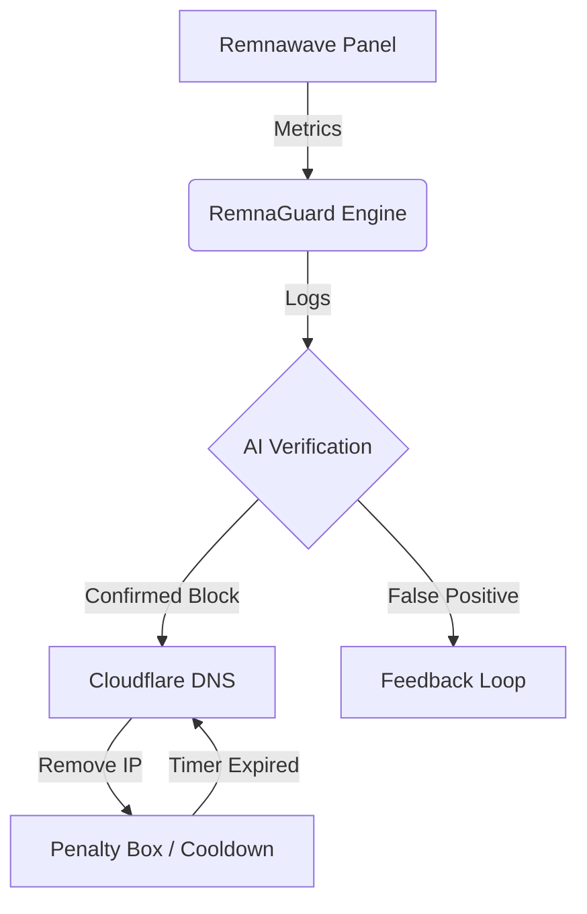

# 🛡️ RemnaGuard
**Autonomous AI Sentinel for Remnawave Clusters.**

RemnaGuard is a high-performance monitoring and self-healing system designed to protect Remnawave (Xray/V2Ray) clusters from GFW probing, traffic throttling, and performance degradation.



---

## 🚀 Advanced Features

### 🧠 AI-Powered Analysis (Gemini)
- **Smart Baselines**: AI analyzes 24h history to set dynamic thresholds 4 times/day.
- **Verification Engine**: Before alerting, Gemini verifies if a drop is a "Real Block" or a "Quiet Period".
- **Feedback Loop (New)**: Use 👍/👎 buttons in Telegram to train the AI. "Wrong" verdicts are saved as negative examples for future prompts.
- **Model Selector**: Switch between `gemini-pro`, `gemini-1.5-flash`, and others on the fly.

### 🛡️ Cloudflare Self-Healing (Beta)
RemnaGuard can automatically manage your DNS to bypass GFW throttling:
- **Automatic Ban**: If Gemini confirms a node is blocked/throttled, RemnaGuard removes its `A` record from Cloudflare.
- **Cooldown Box**: Banned nodes are held in a "Penalty Box" for 1 hour to let GFW sessions expire.
- **Auto-Recovery**: After the cooldown, the node is re-added to DNS for a "Probation Trial".

### 📊 Visualization & Reporting
- **Sparkline Trends**: 6-hour efficiency graphs visualized in ASCII.
- **Daily Digest**: Midnight summaries of cluster health, incidents, and peak usage.
- **Uptime Tracking**: 7-day availability percentages for every node.

---

## 🛠️ Configuration

### 1. Environment Variables (`.env`)
| Variable | Description |
|:---|:---|
| `GEMINI_API_KEY` | Your Google AI Studio key. |
| `CLOUDFLARE_API_TOKEN` | Token with `Zone.DNS` edit permissions. |
| `BOT_MODE` | `polling` (Master) or `notify-only` (Worker). |

### 2. DNS Mapping Script
Instead of editing JSON manually, use our interactive wizard:
```bash
./setup_dns.sh
```
This script helps you map Remnawave Node Names to your Cloudflare domains and set Proxy (Orange Cloud) status.

---

## 🤖 Bot Commands

| Command | Description |
|:---|:---|
| **/start** | Main Dashboard & Menu |
| **/dns_status** | View active Cloudflare bans and cooldown timers |
| **/analyze [node]** | Ask Gemini for a deep-dive performance analysis |
| **/ai_model** | Change the active Gemini model |
| **/config** | Edit monitoring thresholds without restarting |
| **/export** | 📦 Download the database for backup |
| **/uptime** | View 7-day availability stats |

---

## 🐳 Docker Management

**Restarting** (Apply changes):
```bash
docker compose restart remnaguard
```

**Live Logs**:
```bash
docker compose logs -f remnaguard
```

---

## 📝 Troubleshooting
- **AI not responding?** Check `GEMINI_API_KEY` in `.env`.
- **DNS not rotating?** Ensure the `Node Name` in Remnawave matches the name in `setup_dns.sh`.
- **Bot crashes?** View logs and look for `AttributeError`. Ensure you have run `./install.sh` to update dependencies.

---
Built for the Remnawave Community. MIT License.

